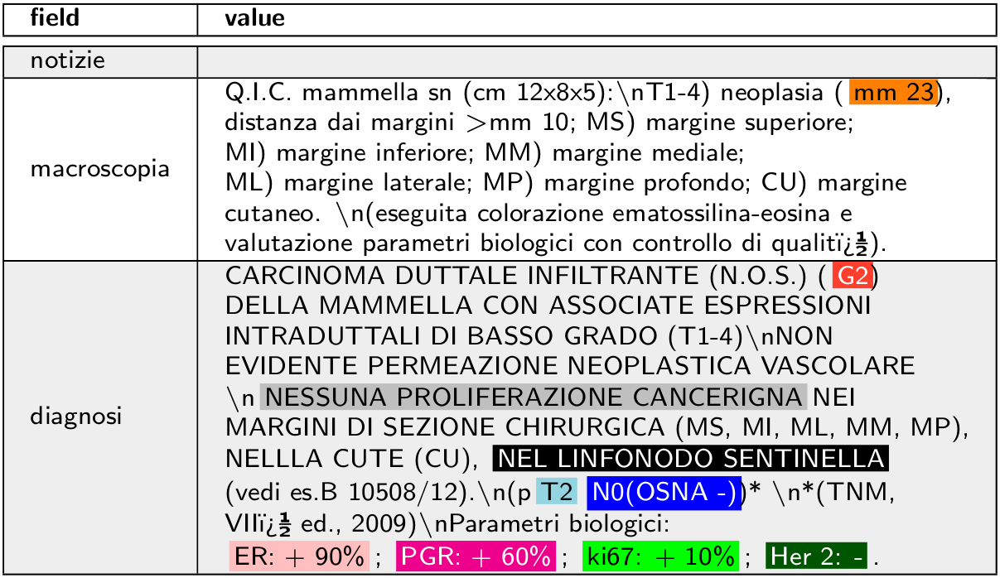
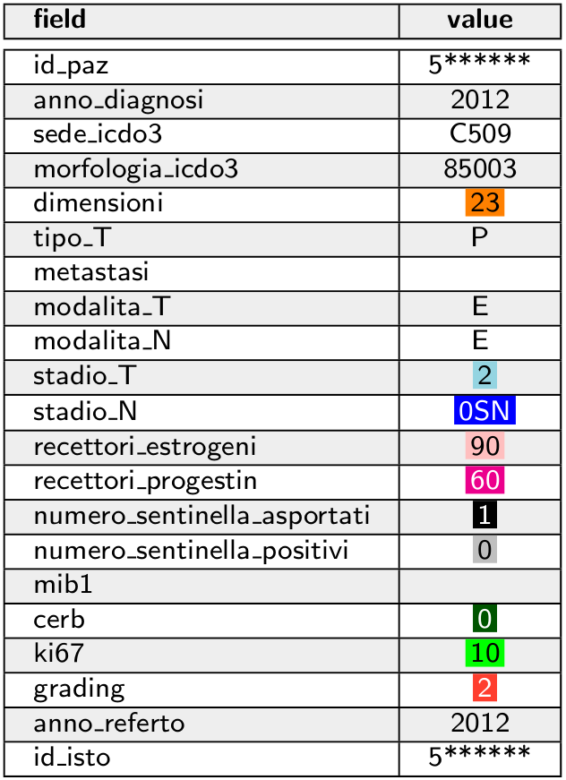
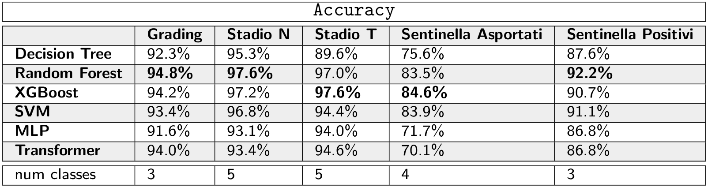
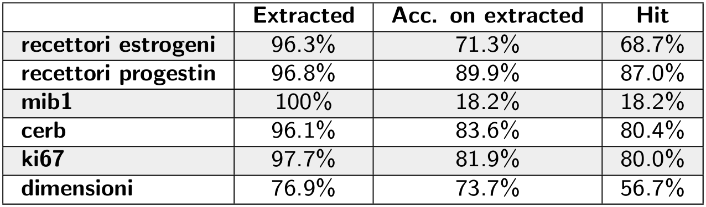

# Prediction of variables from cancer reports

Doctors who follow oncological patients write a medical report in **natural language** after each visit.

Institutions such as ISPRO collects these reports to do statistical analyses.
They have experts that manually analyze these reports to **extract variables**: a big problem in this process is that there are about **5 years of delay**.

## Objective of this thesis
We investigate whether it's possible to algorithmically analyze these reports.
This could help humans to keep up and analyze all data without so big delays. We focus on a dataset of breast cancer reports, collected in Tuscany.

After an in-depth analysis of the dataset, we propose different approaches for two distinct variables groups.
For the first group we compare many **Machine Learning** and **Deep Learning models**, experimenting that XGBoost and Random Forests perform better than Transformer-based Neural Networks.
For the second group of variables, we extract predictions from text with a **regex-based algorithm**.

We show that it is possible to achieve **very good results** for many of the variables of interest.

## Repository info
This repository contains the code used in the experiments.
The [train.py](train.py) script can be used to train a classifier, the classifiers are inside the models directory.
The [manual_predictions.py](manual_predictions.py) script makes the predictions with a regex-based algorithm, which is not a machine-learning model.

In this repository there are also functionalities that weren't used in the thesis' experiments, such as multi-task learning for Neural Network models.

## Requirements
developed and tested with python 3.8

Install libraries:

+ install packages: `pip install -r requirements.txt`

+ install italian language for spacy: `python -m spacy download it`

Optional (not used in the experiments):

+ install wordnet and omw for nltk: `python -m nltk.downloader wordnet omw`

### GPU requirements (optional)
developed and tested with CUDA 10.0.130

+ install CUDA with conda: `conda install cudatoolkit=10.0 cudnn`

+ or install CUDA without conda: https://developer.nvidia.com/cuda-10.0-download-archive

## Datasets
The data are not publicly available. The data was provided by ISPRO, an association that collects oncological reports from all over Tuscany.

Prepare the dataset with reports of all cancers, collected between the 80's and 2011.

`python3 prepare_old_dataset.py`

Prepare the dataset with breast-cancer specific reports and variables, labeled between 2003 and 2015.

`python3 prepare_new_dataset.py`

### Example of report
Doctors write the report by inserting text in three different fields. Below there is an example of a report.

The patient can have more than one report.
ISPRO's experts analyze these reports to extract the values of the variables for that patient.

For some variables, we highlighted the words that identify the value to associate to the variable.

## Training models
`python3 train.py [args]`

To view available arguments with description, run: `python3 train.py -h`

Each trained model is associated with a randomly-generated unique identifier.

The identifier is also the name of the subdirectory (inside trained_models directory) that contains all the information of the created model. 

### Example: train a model on the old dataset, to create a classifier that filters only breast cancer reports
`python3 train.py -d datasets/all_cancer_types -m models.nn.transformer.Transformer -ma '{"embedding_dim":256,"deep_features":256,"dropout":0.1,"num_heads":4,"n_layers":1}' -lr 1e-4 -tc sede_icdo3 -lp '{"sede_icdo3":[{"type":"regex_sub","subs":[["^C5.*",1],["^C.*",0]]},{"type":"filter","valid_set":[0,1]}]}' -ml 100 -e 10 -pt max`

The created model is capable of predicting whether a particular report concern breast cancer or not.

### Example: train a model on the new dataset, using the previously-created filter to select breast cancer reports
Add the following arguments when training a model on the new dataset (replace the model identifier with the correct one):

`-f classifier -fa  '{"path":"trained_models/2021-05-12_21.35.44_Transformer_2H05AA/model_best.pth","encoded_data_column":"helper_tokens","max_length":100}'`

In the breast cancer dataset, there is a minor percentage of non-breast-cancer reports.
In preliminary results, we didn't notice significant differences when using the filter, so we didn't use it the thesis' experiments. 

### Example: train a multi-task model on the new dataset
`python3 train.py -m models.nn.transformer.Transformer -ma '{"embedding_dim":256,"deep_features":256,"dropout":0.1,"num_heads":4,"n_layers":1}' -lr 1e-4 -ml 100 -gb id_paz -e 100 -pt max -pr max -tc grading stadio_N stadio_T`

## Experiments
A detailed explanation of the experiments can be found in the [thesis](docs/thesis.pdf).
The experiments in the thesis can be reproduced using the commands in [experiments.sh](experiments.sh).

We formulate the prediction of some variables as a classification problem, comparing different Machine Learning models.

Ensemble of trees (*Random Forest* and *XGBoost*) are the best performing models. *Neural Networks* do not obtain better results. One of the usual advantages of using *Neural Networks* is that they are capable of learning good representations of the examples.
Probably, a bag-of-*n*-grams representation is enough to describe the record of a patient in this dataset, and Neural Networks are not capable of extracting a better representation.
The cause can be the limited amount of data and how these reports are written: there are mainly keywords and numbers.

Other variables aren't suitable to be classified: the value of the variable is a number (usually a percentage) written in the text.
We predict these variables using a *regex-based* algorithm, which is not a Machine Learning model.

With this algorithm, we achieve good results, apart from *mib1* and *dimensioni* variables. The former has very few labels in the dataset, whereas the latter is more difficult to predict since it appears in multiple units of measure and it is not a percentage, so it's easier to misidentify the number to extract.
